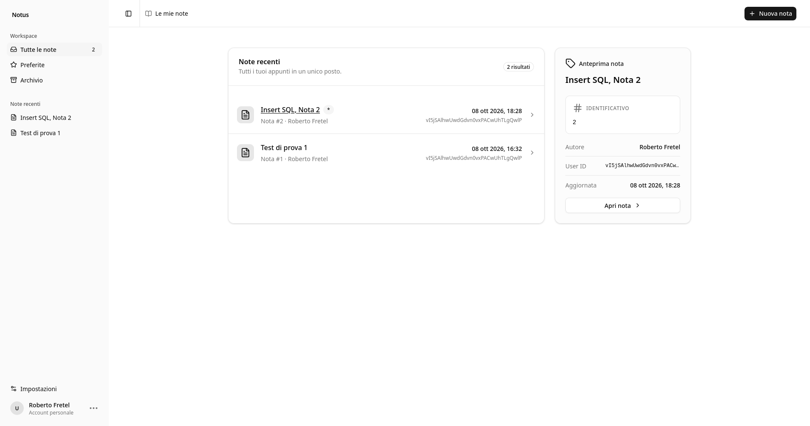

# Progetto di basi di dati
In questo file voglio spiegare come costruisco un sistema di base di dati da implementare in una web app di gestione delle note, degli appunti, o di qualsiasi cosa!

### Architettura
- Bun come runtime typescript;
- React in client side rendering + react-router per il frontend;
- Elyisia come server web per la API di autenticazione (tramite better-auth), ma anche per gestire le note;
- PostgreSQL come database sia per gli utenti che per le note;

> **NB**: Userò Bun.SQL per collegarmi al server postgres e fare le query.

---

### Come gestisco le note
In questo esempio voglio farvi vedere come poter strutturare una vista (ovvero una relazione derivata), che mi permetta di ricevere la lista delle note create per utente!
```sql
CREATE VIEW note_utente AS
SELECT public.user.id as userId, public.user.name as nome, public.note.id as notaId, public.note.titolo as titoloNota
FROM public.user, public.note
WHERE public.note.author = public.user.id
```

Nella mia API sarà sufficiente costruire una route `GET` e fare una chiamata a questa vista mettendo come valore dell'attributo userId quello della sessione, salvato su un cookie apposito, oppure semplicemente mettendolo come parametro.

- [x] crea la vista `note_utente` usando il codice SQL scritto sopra.

---

### GET: /api/note

Questa rotta fa una chiamata alla vista citata prima tramite un SELECT di tutti gli attributi delle tuple che hanno come userId quello corrispondente all'utente loggato
```sql
SELECT * FROM note_utente WHERE userid = $1
```
Chiaramente per ottenere informazioni sull'utente loggato, siccome sto usando better-auth ho deciso di usare direttamente la loro api, passando direttamente gli headers dove (se presente) c'è il cookie con tutte le info sull'utente.

```typescript
const session = await auth.api.getSession({
  headers: request.headers
})
```
---
### Anteprima della dashboard per capire quali query aggiungere


Come si può vedere dall'immagine dobbiamo aggiungere sulla relazione note degli attributi necessari, come `preferito` e `archiviato` e successivamente riportare queste informazioni sulla view `note_utente`

```sql
ALTER TABLE note
ADD COLUMN preferito BOOLEAN NOT NULL DEFAULT false;
ADD COLUMN archiviato BOOLEAN NOT NULL DEFAULT false;
```

E in modo analogo pure sulla view 

### A questo punto

Ho creato una API route **GET /api/nota/:id** che non fa altro che fare un select dove però prende solo il la tupla che ha come id (che è primary key, per garantire l'unicità) l'id messo come parametro al momento della richiesta.

```sql
SELECT *
FROM note
WHERE author = $1 AND id = $2
ORDER BY updated_at DESC 
```

Inoltre mi serve una API route **GET /api/note/preferite** che ritorna unicamente le note con il valore true all'attributo preferito, ovvero:

```sql
SELECT *
FROM note_utente
WHERE userid = $1 AND preferito = true
```

Una query analoga per la route **GET /api/note/archiviate** che ritorna unicamente le note archiviate, quindi con valore true all'attributo archiviato:

```sql
SELECT *
FROM note_utente
WHERE userid = $1 AND archiviato = true
```

### Update dei dati
> Sto scrivendo dal sito stesso questa parte perchè sono già riuscito ad implementare la funzionaiità di update, in verità in modo moolto molto semplice eheheh.

Sono partito creando un api route **PATCH /api/nota/:id** che chiedesse come body della richiesta un contenuto, da mettere al posto di quello salvato nella tupla, poi con la query sql ho fatto l'UPDATE mettendo sempre come condizioni di modificare la nota che avesse l'id della route e di essere l´autore della nota
```sql
UPDATE note SET contenuto = $1 WHERE id = $2 AND author = $3 RETURNING *
``` 

Quel `RETURNING` è necessario per dire a postgres di ritornare tutti gli attributi della tupla modificata (mi serve per il frontend)